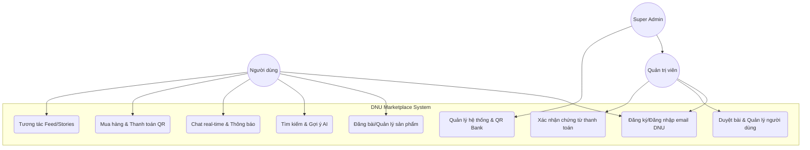
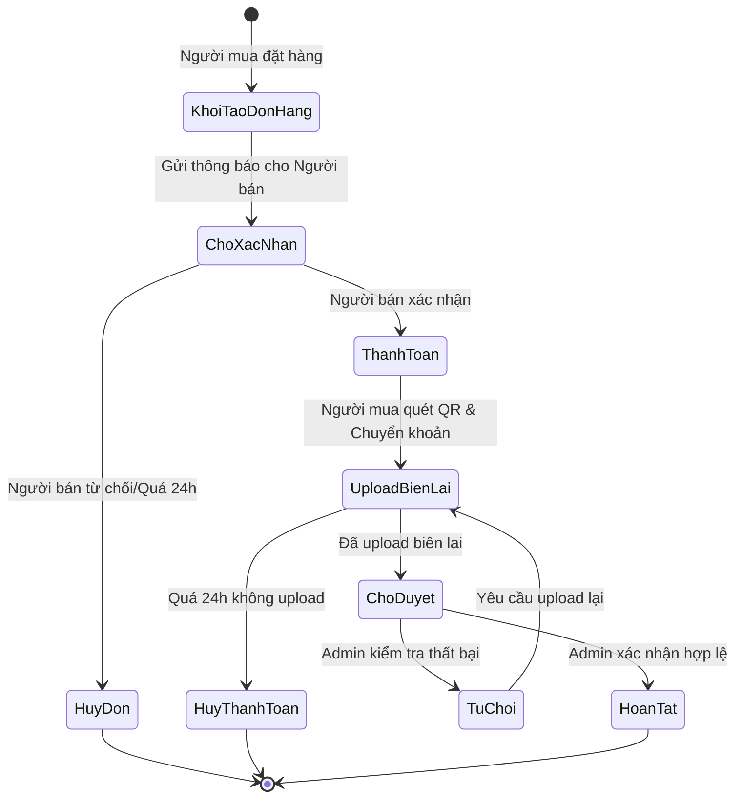
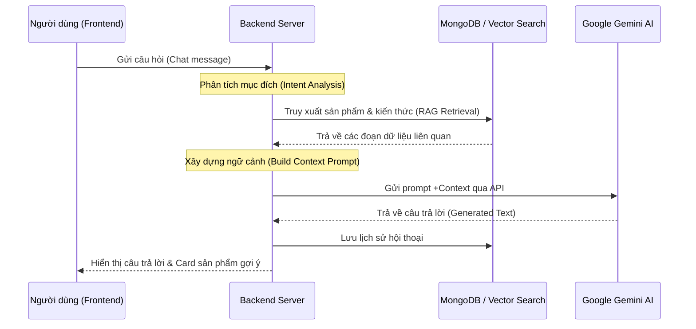
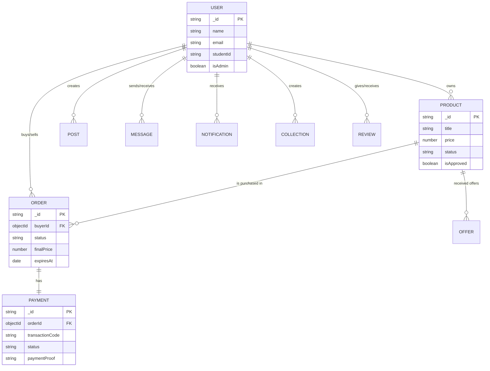
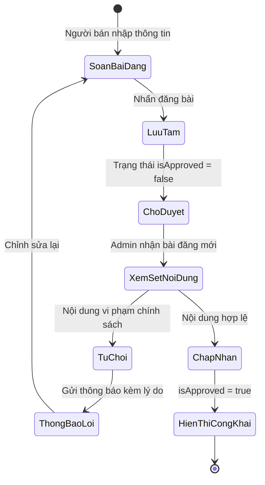
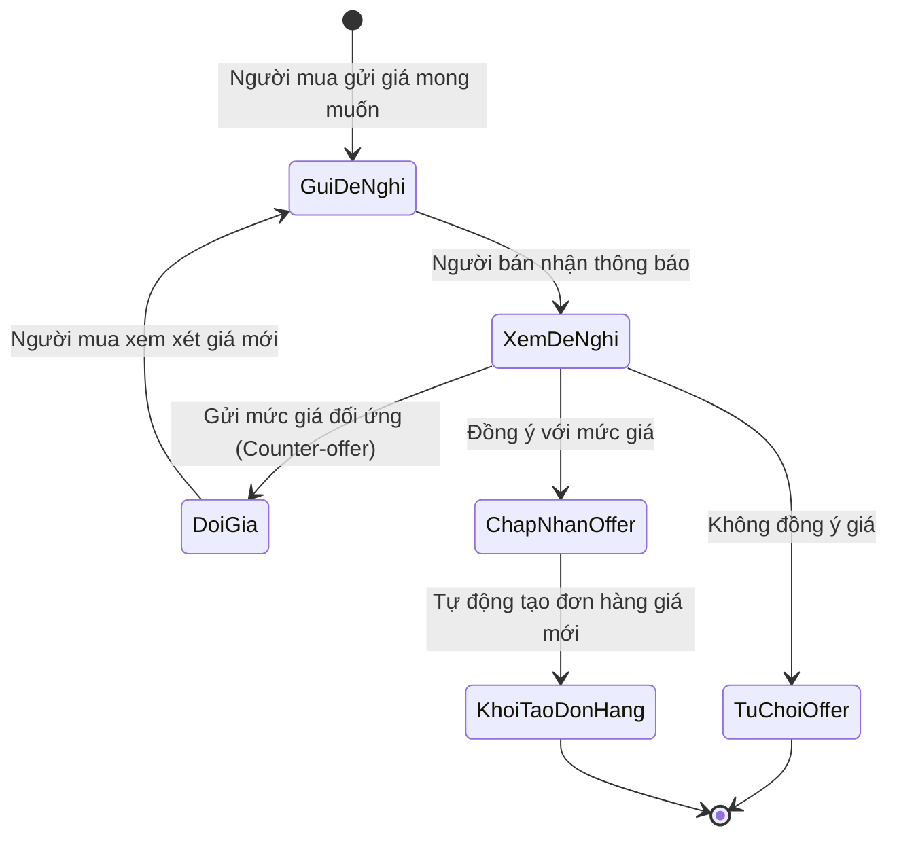
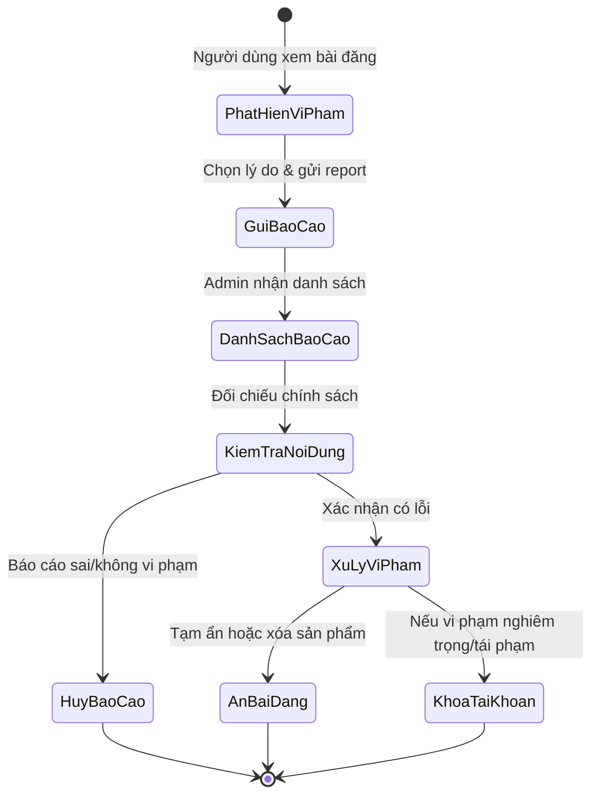
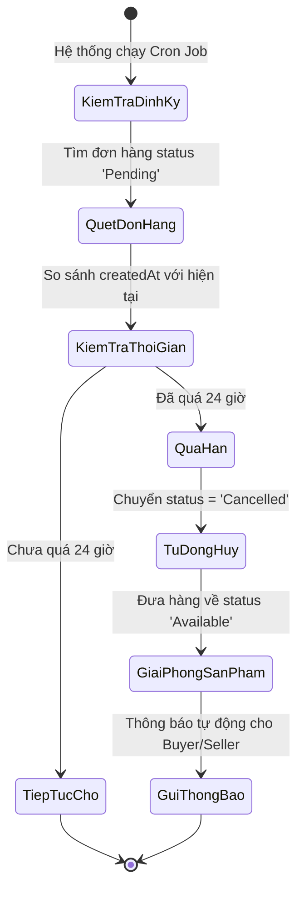

# CHƯƠNG 3: PHÂN TÍCH VÀ THIẾT KẾ HỆ THỐNG

## 3.1. Phân tích yêu cầu

Công việc phân tích yêu cầu đóng vai trò tiên quyết trong việc định hình cấu trúc và định hướng phát triển cho hệ thống DNU Marketplace. Yêu cầu của hệ thống được chia làm ba nhóm chính bao gồm yêu cầu nghiệp vụ, yêu cầu chức năng và yêu cầu phi chức năng, nhằm đảm bảo sản phẩm cuối cùng không chỉ đáp ứng đúng mục đích sử dụng mà còn vận hành bền vững trong môi trường thực tế của sinh viên Đại học Đại Nam.

Về mặt yêu cầu nghiệp vụ, hệ thống được thiết kế để giải quyết bài toán lưu thông đồ dùng cũ trong cộng đồng sinh viên một cách hiệu quả và an toàn nhất. Nghiệp vụ cốt lõi là quy trình mua bán trực tiếp giữa các cá nhân (C2C), nơi người bán có thể dễ dàng thanh lý tài sản còn giá trị và người mua có thể sở hữu món đồ cần thiết với chi phí tối ưu. Điểm đặc biệt trong nghiệp vụ của sàn là tích hợp quy trình thanh toán qua mã QR ngân hàng, đòi hỏi hệ thống phải quản lý được các bằng chứng giao dịch thông qua việc tải lên biên lai chuyển khoản, giúp minh bạch hóa quá trình thanh toán nội bộ. Bên cạnh đó, nghiệp vụ của sàn còn hướng tới việc xây dựng một môi trường tương tác năng động thông qua bảng tin (News Feed), nơi cập nhật liên tục các tin tức mới nhất về sản phẩm và các bài đăng chia sẻ kinh nghiệm sử dụng đồ dùng, giúp tăng cường tính cộng đồng và tần suất sử dụng ứng dụng.

Về yêu cầu chức năng, hệ thống cung cấp một bộ công cụ hoàn chỉnh để người dùng thực hiện mọi tương tác cần thiết trên nền tảng. Chức năng xác thực là cửa ngõ đầu tiên, bắt buộc sinh viên phải đăng ký và đăng nhập thông qua hệ thống email định danh của nhà trường để đảm bảo tính chính danh. Sau khi vào hệ thống, chức năng đăng bài cho phép người sử dụng mô tả sản phẩm, tải lên hình ảnh và thiết lập giá bán một cách nhanh chóng. Chức năng nổi bật nhất và mang tính đột phá của đề tài là trợ lý ảo AI Chatbot, hỗ trợ người dùng tìm kiếm thông tin thông qua ngôn ngữ tự nhiên và giải đáp các thắc mắc về kỹ thuật hay chính sách sàn. Song hành với đó là chức năng gợi ý sản phẩm thông minh, dựa trên lịch sử xem hàng và danh mục quan tâm để cá nhân hóa trang chủ cho từng sinh viên, giúp rút ngắn thời gian tìm kiếm những món đồ thực sự cần thiết.

Đối với các yêu cầu phi chức năng, dự án đặt trọng tâm vào các tiêu chí về bảo mật, hiệu năng và tính thân thiện của giao diện. Yêu cầu về bảo mật được ưu tiên hàng đầu để bảo vệ dữ liệu cá nhân của sinh viên và ngăn chặn các hành vi tấn công trái phép bằng cách sử dụng các giao thức mã hóa dữ liệu và cơ chế xác thực JWT nghiêm ngặt. Về hiệu năng, hệ thống cần đảm bảo tốc độ phản hồi nhanh, đặc biệt là trong các thao tác tìm kiếm và tải lên hình ảnh, ngay cả khi số lượng người dùng truy cập đồng thời tăng cao. Cuối cùng, yêu cầu về giao diện thân thiện đòi hỏi sản phẩm phải có thiết kế trực quan, bố cục rõ ràng và nhất quán, giúp người dùng ở mọi trình độ công nghệ đều có thể làm quen và sử dụng thành thạo ngay từ lần đầu tiên. Toàn bộ các yêu cầu phi chức năng này tạo nên một lớp nền tảng vững chắc cho sự thành công và độ bền vững của ứng dụng trong tương lai.

## 3.2. Thiết kế các sơ đồ UML

Quá trình thiết kế các sơ đồ UML (Unified Modeling Language) là bước chuyển tiếp quan trọng từ việc phân tích yêu cầu sang việc xây dựng cấu trúc chi tiết cho hệ thống. Thông qua việc mô hình hóa bằng các lược đồ, chúng ta có thể trực quan hóa các tương tác giữa người dùng và hệ thống, luồng xử lý các nghiệp vụ phức tạp cũng như trình tự phối hợp giữa các thành phần kỹ thuật bên trong, đảm bảo tính nhất quán và giảm thiểu sai sót trong quá trình cài đặt mã nguồn.

### 3.2.1. Sơ đồ Use Case tổng quát

Sơ đồ Use Case đóng vai trò xác định ranh giới hệ thống và các tương tác chính của các tác nhân (Actors). Trong hệ thống DNU Marketplace, chúng ta có ba nhóm tác nhân chính là Người dùng (bao gồm cả tư cách Người mua và Người bán), Quản trị viên (Admin) và Siêu quản trị viên (Super Admin). Đối với nhóm Người dùng, các tương tác cốt lõi xoay quanh việc quản lý tài khoản, đăng tin bán đồ cũ, tìm kiếm sản phẩm thông qua gợi ý AI, gửi tin nhắn trực tiếp cho đối tác và tham gia vào mạng xã hội nội bộ như xem Feed hay Stories. Tác nhân Admin tập trung vào việc kiểm duyệt nội dung bài đăng, quản lý danh sách người dùng và đặc biệt là phê duyệt các bằng chứng thanh toán để đảm bảo giao dịch hợp lệ. Cuối cùng, Super Admin nắm giữ quyền hạn cao nhất trong việc điều hình cấu trúc hệ thống, quản lý thông tin tài khoản ngân hàng và các thiết lập QR của sàn. Trợ lý AI mặc dù là một thành phần hệ thống nhưng cũng có thể được xem như một tác nhân hỗ trợ, tương tác trực tiếp với người dùng để giải đáp thắc mắc và định hướng nhu cầu.

### 3.2.2. Sơ đồ Hoạt động cho quy trình thanh toán QR

Sơ đồ Hoạt động mô tả chi tiết luồng xử lý của một trong những nghiệp vụ quan trọng nhất của sàn là quy trình mua hàng và thanh toán thông qua mã QR. Điểm bắt đầu của hoạt động này là khi người mua lựa chọn sản phẩm và nhấn nút "Mua ngay", dẫn đến việc khởi tạo một đơn hàng ở trạng thái chờ. Ngay khi đó, hệ thống sẽ thông báo cho người bán để thực hiện việc xác nhận đơn hàng – một bước kiểm tra cần thiết để đảm bảo hàng hóa vẫn sẵn có. Sau khi được người bán xác nhận, người mua sẽ tiến hành bước thanh toán bằng cách quét mã QR ngân hàng được hệ thống cung cấp và thực hiện chuyển khoản với mã giao dịch tương ứng. Hoạt động quan trọng nhất để kết nối luồng nghiệp vụ này là người mua phải tải lên hình ảnh biên lai thành công. Lúc này, luồng hoạt động chuyển sang phía Quản trị viên để tiến hành kiểm tra chứng từ (số tiền, nội dung chuyển khoản). Nếu hợp lệ, đơn hàng sẽ được chuyển sang trạng thái đã thanh toán và hoàn tất, ngược lại đơn hàng sẽ bị từ chối hoặc yêu cầu cung cấp lại bằng chứng. Toàn bộ quy trình này đảm bảo tính chặt chẽ và giảm thiểu rủi ro cho cả hai bên tham gia giao dịch.

### 3.2.3. Sơ đồ Tuần tự cho chức năng trợ lý AI Chatbot

Sơ đồ Tuần tự được sử dụng để làm rõ quá trình phối hợp phức tạp giữa các thành phần công nghệ khi người dùng tương tác với Chatbot AI sử dụng kiến trúc RAG. Quy trình bắt đầu bằng việc người dùng gửi một tin nhắn từ giao diện Frontend. Tin nhắn này được đẩy đến Backend qua API, nơi hệ thống sẽ phân tích nội dung để xác định xem người dùng đang hỏi về sản phẩm hay các quy định chung. Tiếp đến, hệ thống sẽ thực hiện truy vấn đồng thời đến dịch vụ nhúng vectơ để tìm kiếm các sản phẩm phù hợp trong database và tìm kiếm trong kho tri thức nội bộ. Các kết quả trả về từ quá trình truy xuất này được tổng hợp thành một ngữ cảnh văn bản giàu thông tin (Augmented Context). Sau đó, Backend sẽ thực hiện lời gọi API đến mô hình Google Gemini kèm theo ngữ cảnh vừa xây dựng. Khi nhận được phản hồi từ AI, hệ thống sẽ lưu lại lịch sử hội thoại để duy trì sự nhất quán cho các câu hỏi sau và trả kết quả về cho Frontend để hiển thị cho người dùng. Toàn bộ chuỗi tương tác này diễn ra một cách liền mạch, giúp người dùng có cảm giác đang trò chuyện với một trợ lý thực thụ có hiểu biết sâu sắc về dữ liệu của sàn.

## 3.3. Thiết kế cơ sở dữ liệu

Thiết kế cơ sở dữ liệu là nền tảng cốt lõi giúp hệ thống quản lý và vận hành toàn bộ các luồng thông tin một cách nhất quán và hiệu quả. Hệ thống DNU Marketplace sử dụng cơ sở dữ liệu NoSQL (MongoDB), cho phép lưu trữ dữ liệu dưới dạng các tài liệu (documents) linh hoạt nhưng vẫn đảm bảo được mối quan hệ chặt chẽ giữa các thành phần thông qua việc sử dụng các tham chiếu ObjectId.

### 3.3.1. Sơ đồ thực thể quan hệ (ERD)

Sơ đồ ERD thể hiện mối liên kết giữa các thực thể chính trong hệ thống, giúp chúng ta cái nhìn tổng quan về cách dữ liệu được tổ chức và liên kết. Thực thể trung tâm là Người dùng (User), có mối quan hệ trực tiếp với Sản phẩm (Product), Đơn hàng (Order) và các bài đăng mạng xã hội. Một người dùng có thể đóng vai trò là Người bán (Seller) khi đăng bài hoặc Người mua (Buyer) khi thực hiện các hoạt động thanh toán và đề nghị giá. Các thực thể phụ bổ trợ như Payment (Thanh toán), Offer (Trả giá) và Message (Tin nhắn) giúp hoàn thiện các luồng nghiệp vụ phức tạp về thương mại và tương tác.

### 3.3.2. Chi tiết các Collection chính

Mỗi Collection trong hệ thống được thiết kế với các trường dữ liệu tối ưu, đảm bảo tính đầy đủ và tốc độ truy xuất. Collection Người dùng (Users) không chỉ lưu trữ thông tin cơ bản mà còn chứa các trường xác thực sinh viên và các chỉ số mạng xã hội như số người theo dõi. Collection Sản phẩm (Products) là trái tim của hệ thống, lưu trữ chi tiết về tình trạng, giá cả, hình ảnh và danh sách các báo cáo vi phạm nếu có. Đặc biệt, Collection Đơn hàng (Orders) và Thanh toán (Payments) được thiết kế đồng bộ với các trường thời gian hết hạn (expiresAt) để phục vụ cho các tác vụ tự động hủy giao dịch quá hạn. Ngoài ra, các Collection như Messages và Offers được tối ưu hóa để hỗ trợ các tính năng thảo luận giá cả và trò chuyện thời gian thực, tạo nên sự liền mạch trong trải nghiệm mua bán của sinh viên trường Đại học Đại Nam.

## 3.4. Thiết kế giao diện (UI/UX)

Thiết kế giao diện của sàn thương mại điện tử DNU Marketplace hướng tới sự hiện đại, tinh gọn và tối ưu hóa tối đa cho trải nghiệm của sinh viên trên cả nền tảng web và thiết bị di động. Triết lý thiết kế chủ đạo là Clean Design, tận dụng khoảng trắng và các tone màu trang nhã để làm nổi bật hình ảnh sản phẩm. Hệ thống lưới (Grid system) được áp dụng nhất quán giúp giao diện luôn cân đối và chuyên nghiệp, tạo niềm tin cho người dùng khi tham gia các hoạt động mua bán và thanh toán trực tuyến.

### 3.4.1. Giao diện Trang chủ và Danh mục

Trang chủ được thiết kế để cung cấp cái nhìn tổng quát nhất về toàn bộ hệ thống ngay từ lần đầu truy cập. Thành phần nổi bật nhất là thanh tìm kiếm thông minh tích hợp gợi ý theo thời gian thực và chatbot AI luôn sẵn sàng hỗ trợ. Các sản phẩm được hiển thị dưới dạng lưới với các thông tin tóm tắt như tiêu đề, giá bán, tình trạng và đánh giá sao, giúp người dùng dễ dàng lướt nhanh và tìm kiếm món đồ ưng ý. Các thẻ danh mục được bố trí trực quan giúp việc điều hướng giữa các nhóm hàng như Sách, Điện tử hay Nội thất trở nên đơn giản và thuận tiện.

### 3.4.2. Giao diện Chi tiết Sản phẩm

Trang chi tiết sản phẩm là nơi cung cấp đầy đủ nhất về thông tin món đồ, giúp người mua đưa ra quyết định cuối cùng. Hình ảnh sản phẩm được hiển thị ở kích thước lớn với độ phân giải cao, kèm theo các thông tin chi tiết về mô tả kỹ thuật, khu vực giao dịch và thông tin người bán. Các nút chức năng quan trọng như "Mua ngay", "Trả giá" và "Nhắn tin" được thiết kế nổi bật với các trạng thái tương tác rõ ràng. Đặc biệt, phần đánh giá và bình luận từ những người dùng khác giúp tăng tính khách quan và tin cậy cho bài đăng.

### 3.4.3. Giao diện Trợ lý ảo AI Chatbot

Giao diện Chatbot AI được thiết kế dưới dạng một cửa sổ hội thoại thông minh mang phong cách hiện đại. Không chỉ dừng lại ở việc phản hồi văn bản, chatbot còn có khả năng hiển thị trực tiếp các thẻ sản phẩm (Product Cards) ngay trong khung chat khi người dùng yêu cầu tìm kiếm hoặc gợi ý. Các hiệu ứng chuyển động mượt mà và giao diện hội thoại thân thiện giúp sinh viên có cảm giác như đang tương tác với một chuyên viên tư vấn thực thụ, mang lại sự độc đáo và trải nghiệm công nghệ cao cho hệ thống.

### 3.2.4. Quy trình Đăng tin và Kiểm duyệt Sản phẩm

Quy trình đăng tin và kiểm duyệt sản phẩm là bước kiểm soát chất lượng đầu vào tiên quyết để đảm bảo tính an toàn và minh bạch cho sàn thương mại điện tử DNU Marketplace. Hoạt động bắt đầu khi người bán hoàn thiện biểu mẫu thông tin sản phẩm bao gồm tiêu đề, mô tả, giá bán và tải lên các tệp hình ảnh minh họa. Ngay sau khi nhấn nút đăng bài, hệ thống sẽ thực hiện các bước kiểm tra dữ liệu cơ bản và lưu trữ sản phẩm vào cơ sở dữ liệu với trạng thái chưa phê duyệt. Lúc này, sản phẩm chưa được hiển thị công khai trên sàn mà sẽ được đưa vào danh sách chờ của Quản trị viên. Quản trị viên tiến hành xem xét các yếu tố về nội dung, hình ảnh và phân loại để đảm bảo không vi phạm các chính sách của nhà trường. Nếu sản phẩm đạt yêu cầu, Admin sẽ kích hoạt trạng thái phê duyệt giúp sản phẩm xuất hiện trên các trang danh mục và tìm kiếm của người dùng khác. Trong trường hợp bị từ chối, hệ thống sẽ gửi thông báo kèm lý do cụ thể để người bán có thể sửa đổi hoặc xóa bài đăng, giúp duy trì một cộng đồng trao đổi lành mạnh và chất lượng.

### 3.2.5. Quy trình Đề nghị giá (Make Offer)

Quy trình đề nghị giá là một tính năng đặc thù giúp tăng tính linh hoạt và tương tác trực tiếp giữa người mua và người bán đối với các sản phẩm đồ dùng cũ. Hoạt động khởi đầu khi người mua cảm thấy mức giá niêm yết chưa phù hợp và quyết định gửi một đề nghị giá mới thấp hơn thông qua hệ thống Chat. Khi nhận được đề nghị, người bán có quyền xem xét dựa trên tình trạng món đồ và nhu cầu thanh lý để đưa ra quyết định. Người bán có ba hướng xử lý chính: chấp nhận ngay mức giá đó, từ chối đề nghị nếu cảm thấy mức giá quá thấp, hoặc đưa ra một mức giá đối ứng trung gian. Nếu người bán chấp nhận, hệ thống sẽ tự động chuyển đổi đề nghị này thành một đơn hàng chính thức với mức giá đã thỏa thuận, giúp tối giản hóa quy trình mua bán. Nếu có mức giá đối ứng, quy trình sẽ lặp lại quyền quyết định ở phía người mua. Luồng hoạt động này chỉ kết thúc khi hai bên đạt được sự đồng thuận về giá hoặc một bên quyết định dừng thương lượng, tạo nên một cơ chế mặc cả văn minh và thuận tiện ngay trên ứng dụng.

### 3.2.6. Quy trình Xử lý Báo cáo Vi phạm

Để duy trì một môi trường trao đổi an toàn và tuân thủ pháp luật cũng như nội quy nhà trường, quy trình xử lý báo cáo vi phạm được thiết kế để mọi người dùng đều có thể đóng góp vào việc giám sát cộng đồng. Khi phát hiện một bài đăng có dấu hiệu lừa đảo, hàng cấm hoặc ngôn từ không phù hợp, người dùng có thể gửi báo cáo kèm theo lý do chi tiết cho hệ thống. Toàn bộ các báo cáo này sẽ được tập hợp tại trung tâm quản lý của Quản trị viên theo thứ tự ưu tiên hoặc thời gian. Admin sẽ trực tiếp kiểm tra nội dung bị báo cáo bằng cách đối chiếu với các nguyên tắc cộng đồng đã thiết lập. Nếu báo cáo là chính xác, Admin có quyền thực hiện các biện pháp xử lý từ nhắc nhở, xóa bài đăng vi phạm cho đến việc khóa tài khoản người dùng tùy theo mức độ nghiêm trọng. Quy trình này đảm bảo mọi hành vi không chuẩn mực đều được phát hiện và xử lý kịp thời, giữ vững niềm tin của sinh viên khi tham gia sàn giao dịch nội bộ.

### 3.2.7. Quy trình Tác vụ tự động (Cron Jobs)

Quy trình tác vụ tự động đóng vai trò là một quản gia thầm lặng, đảm bảo hệ thống luôn trong trạng thái dữ liệu sạch và chính xác mà không cần sự can thiệp thủ công từ con người. Hệ thống được lập trình để tự động thực hiện các đợt kiểm tra định kỳ (Cron Jobs) đối với các giao dịch đang diễn ra. Một trong những tác vụ quan trọng nhất là quét danh sách các đơn hàng hiện có để tìm ra những đơn hàng đã được người bán xác nhận nhưng người mua không thực hiện việc thanh toán hoặc tải lên biên lai sau 24 giờ kể từ khi được kích hoạt. Ngay khi phát hiện các bản ghi quá hạn này, hệ thống sẽ tự động thực hiện các bước: chuyển trạng thái đơn hàng sang đã hủy, giải phóng trạng thái giữ chỗ của sản phẩm để người mua khác có thể tiếp cận, và gửi thông báo tự động đến cả hai bên về lý do hết hạn. Luồng hoạt động tự động này giúp duy trì tính quay vòng liên tục của hàng hóa trên sàn, tránh tình trạng "giữ hàng ảo" gây thiệt hại cho người bán và ảnh hưởng đến trải nghiệm chung của cộng đồng.

